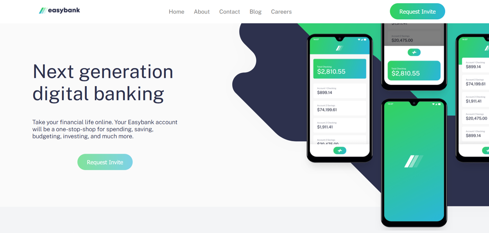

# Frontend Mentor - Easybank landing page

## The challenge

Your challenge is to build out this landing page and get it looking as close to the design as possible.

- View the optimal layout for the site depending on their device's screen size
- See hover states for all interactive elements on the page

## My Solution 

Using only HTML5 and CSS3, I have managed to match the oridinal with good proximity, having only .jpg files for scaling and preview. The webpage is fully responsive, achieved with media querries.

Here are my results:

## Desktop view

## Desktop hover view

I coudn't manage to take photo with the cursor, but in all cases it is a pointer (clicking hand).
k

## Mobile view

## Challenge specification

The design is to be created to the following widths:

- Mobile: 375px
- Desktop: 1440px
